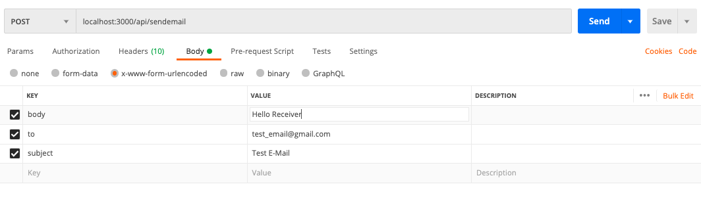

# Email Sending API

## Contents

- [Install and Run](#install_and_run)
- [Initialization](#initialization)
- [Sending Mail](#sending_mails)

<div id="install_and_run"></div>

## Install and Run

Install the project from Github and go to project directory via terminal

> **NOTE:** Download and save project credentials before running the project.

Run following Commands:

```bash
npm install
node index.js
```

For testing the API is running:

Send a `GET` request to `localhost:3000/`

<div id="initialization"></div>

## Initialization

### Storing Credentials from Google

Download and store the credentials in credentials.json file in home directory, and then run the app

### Authorization

You need to give permission to the app for sending the mail from the respective accounts.

- To give the permission send a get request to `localhost:3000/api/initialize`, you will response the follosing JSON response.

```iso
{
    "msg": "Authorize the API using the redirection link",
    "redirect": "link for authentication"
}
```

- Copy the `redirect` link and paste it in browser 

  - You will be asked to choose a Gmail account and give permission to send the mails.

  - On granting the permission the token will be automatically generated and stored.

On Successfull Initiaization you will receive the following response.

```json
{
    "success": true,
    "msg": "Initialization Successful"
}
```

<div id="sending_mails"></div>

## Sending Mail

> NOTE: You must be authorized before sending the mail, otherwise you will be prompted to initialize first.

For sending mail send a `POST` request to `localhost:3000/api/sendemail` with following parameters:

`to`: Recepient Address

`subject`: Subject of Email

`body`: Body of Email



<p align="center"><em>Clipping of how request for sending mail looks like(Postman).</em></p>

